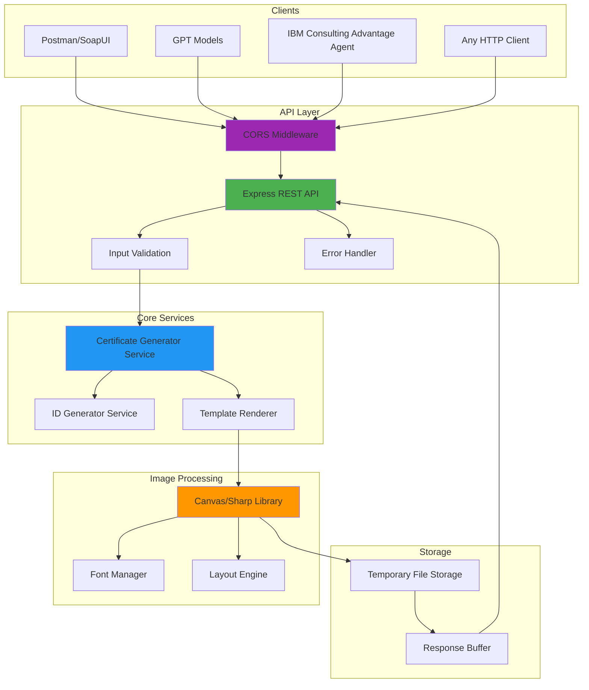
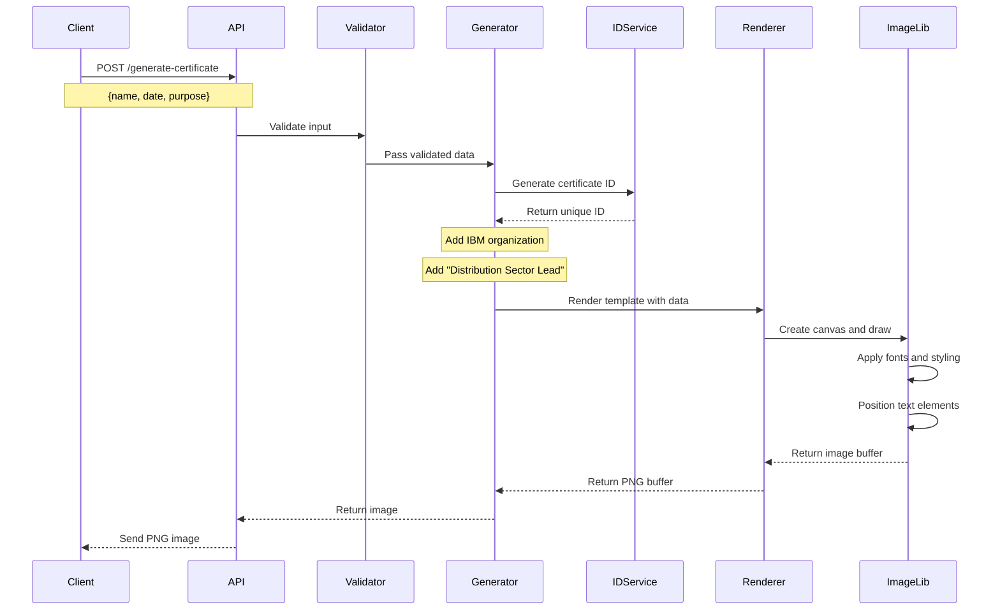
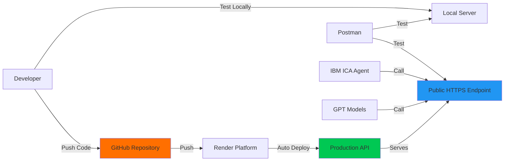

# Certificate Generator API - Technical Architecture

## System Overview

A platform-independent REST API service that generates professional IBM certificate PNG images based on input parameters. The API is designed to be called from any client including Postman, SoapUI, GPT models, IBM Consulting Advantage agents, or any HTTP client.

## Architecture Diagram



## Component Details

### 1. API Layer
- **Express REST API**: Main HTTP server handling requests
- **CORS Middleware**: Enables cross-origin requests from any domain
- **Input Validation**: Validates request parameters before processing
- **Error Handler**: Centralized error handling and response formatting

### 2. Core Services

#### Certificate Generator Service
- Orchestrates the certificate generation process
- Accepts input parameters: name, date, purpose
- Organization is hardcoded as "IBM"
- Coordinates with ID Generator and Template Renderer

#### ID Generator Service
- Generates unique certificate IDs using UUID v4
- Format: `CERT-XXXXXXXX-XXXX-XXXX-XXXX-XXXXXXXXXXXX`

#### Template Renderer
- Applies modern, clean IBM-branded design template
- Positions text elements with proper spacing
- Handles font rendering and styling
- Adds "Distribution Sector Lead" at the bottom

### 3. Image Processing
- **Canvas/Sharp Library**: Core image generation engine
- **Font Manager**: Loads and manages custom fonts
- **Layout Engine**: Calculates positions and dimensions

## API Endpoints

### POST /generate-certificate
Generates an IBM certificate PNG image

**Request Body:**
```json
{
  "name": "John Doe",
  "date": "2026-04-11",
  "purpose": "Completion of Advanced Node.js Course"
}
```

**Response:**
- Content-Type: `image/png`
- Body: PNG image binary data

**Certificate Content:**
- Organization: IBM (hardcoded)
- Signature: None (blank)
- Footer: "Distribution Sector Lead"

### GET /health
Health check endpoint

**Response:**
```json
{
  "status": "healthy",
  "timestamp": "2026-04-11T15:45:00.000Z",
  "version": "1.0.0"
}
```

### GET /api-docs
OpenAPI/Swagger documentation endpoint

## Data Flow



## Technology Stack

### Backend Framework
- **Node.js**: Runtime environment
- **Express.js**: Web framework for REST API

### Image Generation
- **Canvas** or **Sharp**: Image manipulation library
- Custom font support for professional typography

### Utilities
- **uuid**: Unique ID generation
- **cors**: Cross-origin resource sharing
- **express-validator**: Input validation

### Deployment
- **Render**: Cloud hosting platform
- **GitHub**: Version control and CI/CD

## Security Considerations

### Current Implementation
- Input validation to prevent injection attacks
- CORS enabled for accessibility
- Error messages sanitized to prevent information leakage

### Future Enhancements (Optional)
- API key authentication
- Rate limiting to prevent abuse
- Request logging and monitoring
- HTTPS enforcement

## Deployment Architecture



## Certificate Design Specifications

### Layout
- **Dimensions**: 1200px × 900px (4:3 ratio)
- **Background**: White with subtle border
- **Border**: 2px solid line with 20px padding

### Typography
- **Title**: "CERTIFICATE OF ACHIEVEMENT" - 48px, bold
- **Organization**: "IBM" - 32px, bold, IBM blue color
- **Recipient Name**: 36px, bold, centered
- **Purpose**: 24px, regular, centered
- **Details**: 18px, regular
- **Certificate ID**: 14px, monospace
- **Footer**: "Distribution Sector Lead" - 16px, regular, bottom

### Color Scheme (IBM Branding)
- **IBM Blue**: #0F62FE (Primary brand color)
- **Dark Text**: #161616 (IBM Carbon)
- **Gray Text**: #525252 (IBM Carbon)
- **Border**: #E0E0E0 (Light gray)
- **Background**: #FFFFFF (White)

### Spacing
- Top margin: 80px
- Section spacing: 40px
- Line height: 1.5
- Bottom footer: 40px from bottom

### Certificate Structure
```
┌─────────────────────────────────────────┐
│                                         │
│      CERTIFICATE OF ACHIEVEMENT         │
│                                         │
│                  IBM                    │
│                                         │
│            [Recipient Name]             │
│                                         │
│         This certificate is awarded     │
│                   for                   │
│                                         │
│              [Purpose]                  │
│                                         │
│         Date: [Date]                    │
│         Certificate ID: [ID]            │
│                                         │
│                                         │
│       Distribution Sector Lead          │
└─────────────────────────────────────────┘
```

## Integration Examples

### Postman/SoapUI
Standard HTTP POST request with JSON body

**Request:**
```http
POST /generate-certificate HTTP/1.1
Host: your-api.render.com
Content-Type: application/json

{
  "name": "John Doe",
  "date": "2026-04-11",
  "purpose": "Completion of Advanced Node.js Course"
}
```

### GPT Function Calling
```json
{
  "name": "generate_certificate",
  "description": "Generate an IBM certificate for Distribution Sector",
  "parameters": {
    "type": "object",
    "properties": {
      "name": {
        "type": "string",
        "description": "Recipient's full name"
      },
      "date": {
        "type": "string",
        "description": "Certificate date in YYYY-MM-DD format"
      },
      "purpose": {
        "type": "string",
        "description": "Purpose or achievement description"
      }
    },
    "required": ["name", "date", "purpose"]
  }
}
```

### IBM Consulting Advantage Agent
HTTP client integration with JSON payload

```javascript
// Example agent code
const response = await fetch('https://your-api.render.com/generate-certificate', {
  method: 'POST',
  headers: {
    'Content-Type': 'application/json'
  },
  body: JSON.stringify({
    name: 'John Doe',
    date: '2026-04-11',
    purpose: 'Completion of Advanced Node.js Course'
  })
});

const imageBuffer = await response.buffer();
// Save or process the certificate image
```

## Performance Considerations

- **Response Time**: Target < 2 seconds per certificate
- **Concurrent Requests**: Supports multiple simultaneous generations
- **Memory Management**: Buffers cleared after response
- **Caching**: No caching (each certificate is unique)

## Error Handling

### Error Response Format
```json
{
  "error": {
    "code": "VALIDATION_ERROR",
    "message": "Invalid input parameters",
    "details": ["name is required", "date must be valid ISO date"]
  }
}
```

### HTTP Status Codes
- `200`: Success
- `400`: Bad Request (validation error)
- `500`: Internal Server Error
- `503`: Service Unavailable

## Monitoring and Logging

- Health check endpoint for uptime monitoring
- Request/response logging
- Error tracking
- Performance metrics

## Future Enhancements

1. **Multiple Templates**: Support different certificate designs
2. **Custom Fonts**: Allow font selection
3. **Logo Upload**: Add IBM logo image
4. **PDF Generation**: Support PDF format alongside PNG
5. **Batch Generation**: Generate multiple certificates at once
6. **Storage Integration**: Save certificates to cloud storage
7. **Email Integration**: Send certificates via email
8. **QR Code**: Add verification QR codes
9. **Different Sectors**: Support other IBM sectors beyond Distribution